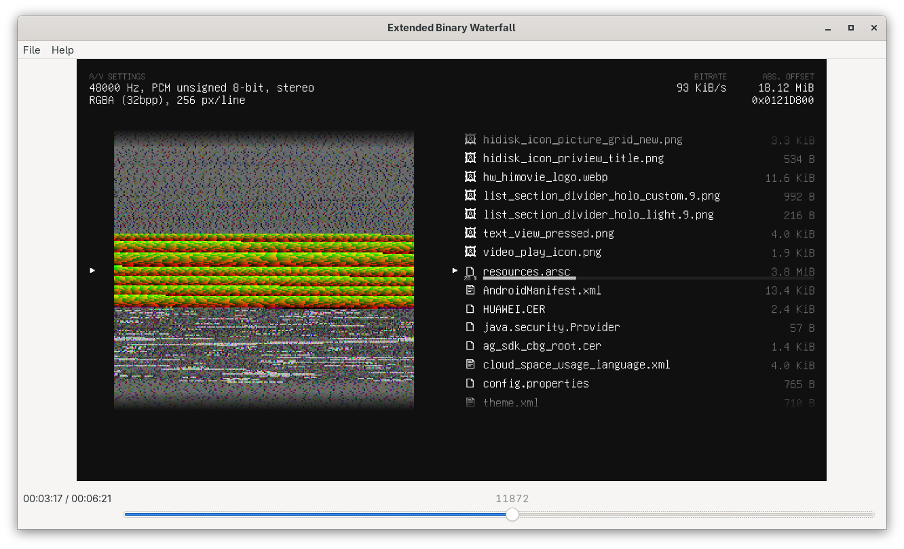

# Extended Binary Waterfall




This program **reads computer files** as **raw audio and video streams**, resulting in what's sometimes known as a **binary waterfall**. The “extended” part of it is the inclusion of a **detailed walktrough** of the **fragments, chunks or subfiles** that the target file may have.

> [!WARNING]
> This program is still in development.
> Some code is still untested, and errors are expected to happen when running this software.

## Download

> [!NOTE]
> You need to install the .NET Runtime on your PC before running the program.

You can download Extended Binary Waterfall from the [Releases page](https://github.com/unai-d/extended-binary-waterfall/releases).

Alternatively, you might want to get the latest unstable builds from [GitHub Actions](https://github.com/unai-d/extended-binary-waterfall/actions).

## Dependencies

- Required
	- .NET 9/10 SDK
		- It hasn't been tested with older versions but it is **probably compatible** with them. You can try lower the version manually in the `csproj` file.
- Optional
	- FFmpeg libraries (for the FFmpeg exporter)
		- In Windows 10/11, use the following command to install FFmpeg:
			```powershell
			winget install "FFmpeg (Shared)"
			```
			Once installed, **restart the command line** and make sure the `PATH` environment variable is updated with the FFmpeg libraries path.
		- Alternatively, you can manually download the libraries at [CODEX FFMPEG](https://www.gyan.dev/ffmpeg/builds/) (make sure to download the “shared” variant).
		Once downloaded, move the DLLs to a known path (e.g. `C:\ffmpeg`).
	- [Unifont](https://unifoundry.com/unifont/index.html)
		- Some Linux distros have the option to install this font via their respective package manager, but in Windows a manual download is required.
		- Make sure to install both the default font and the “upper” variant for emoticons.
	- [`wimlib`](https://wimlib.net/) for WIM file listings.
	- `minidump` Python module for Windows Minidump memory region parsing.

> [!IMPORTANT]
> The OTF version of Unifont hasn't been tested yet, but at some point it made the text rendering library (`SixLabors.Fonts`) throw an error at runtime, allegedly because of OTF CFF2 tables not being supported yet.
> However, as of March 2026, the problem has been apparently solved.
>
> If for some reason you still encounter errors, make sure to install the **TTF format** instead of OTF.
>
> You can **download** the TTF version from an [**unofficial repository**](https://github.com/multitheftauto/unifont) since it doesn't get officially released by Unifoundry as a TTF file anymore.
>
> See the relevant SixLabors Fonts [issue](https://github.com/SixLabors/Fonts/issues/331) and [pull request](https://github.com/SixLabors/Fonts/pull/342) for this specific problem.

## Build and Run

Use `run.sh` to quickly (build if necessary, then) run the program.

Alternatively, standard `dotnet build`/`dotnet run` commands apply:

Use `dotnet build` from the repository's path, then execute `dotnet run --project Unai.ExtendedBinaryWaterfall.Cli` to run the program.

## Usage

### Quick Start

The following commands will assume your command line working directory is located at the resulting binaries from the build process.
If you're on Windows, the executable will be suffixed with `.exe`.

Execute this command to get information about the arguments that can be used:

```sh
Unai.ExtendedBinaryWaterfall.Cli --help
```

When using `run.sh`, the command can be simplified to:

```sh
./run.sh --help
```

### Examples

#### Example 1

Read an ISO file and save the result to a video file called `result.mkv` (requires FFmpeg):

```sh
Unai.ExtendedBinaryWaterfall.Cli /path/to/file.iso --exporter=ffmpeg --output=result.mkv
```

#### Example 2

Read a GameMaker archive file and preview the result in an SDL window:

```sh
Unai.ExtendedBinaryWaterfall.Cli /path/to/data.win
```

SDL is the default exporter if none is specified.

#### Example 3

Read a `.dll` file and preview the FFmpeg encoding result with standard output redirection:

```sh
Unai.ExtendedBinaryWaterfall.Cli "C:\Windows\system32\shell32.dll" --exporter=ffmpeg | ffplay -f matroska -
```

When no `-o`/`--output` argument is specified, EBW will default to the standard output.

> [!WARNING]
> Some command line interfaces like PowerShell will require a proper standard I/O encoding suitable for binary streams.
> Otherwise you will end up with “corrupted” files.
